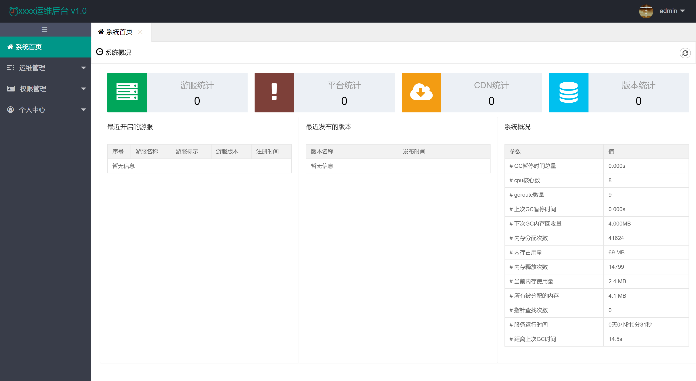

# 游戏服务器运维后台

## 安装
推荐使用 `golang 1.12` 及以上的版本编译。

编译命令：`go build -v -x` 或者 `go build -ldflags "-w -s"`(生成的可执行文件小一点，因为删除了一些调试信息)


## 初始化
可以使用我的 [mysqldiff](https://github.com/shuimu98/mysqldiff/releases) 来初始化数据库，命令如下：

```
mysqldiff -u root -p 123456 -d kgo_admin -f kgo_admin.sql
```
当然，你也可以手动初始化。

数据库创建后，需要初始化菜单表以及添加管理员，导入 `kgo_amdin_init.sql` 到 mysql 中即可。

```
mysql -uroot -p123456 kgo_admin < kgo_admin_init.sql
```
>管理员账号：admin，密码：123456

## 运行

```
nohup ./oam-center > runtime.log &
```

## 原理
在每一组游服主机上运行一个被控端，通过与中央后台的 http 连接进行通信。客户端上传该机器上运行的游服进程情况，而中央后台也可以远程控制游戏服务器，例如：
游戏服务器更新、关闭、热更等，通过减少人工操作，提高游戏维护效率。

该后台需要配置被控端一起使用，因为涉及到一些私密信息（rsync 密码和 api等），被控端暂时不打算开源，**本项目仅限于自娱自乐**😄。

## 参考
本项目前端参考[该项目](https://github.com/george518/PPGo_ApiAdmin)。

## 截图

